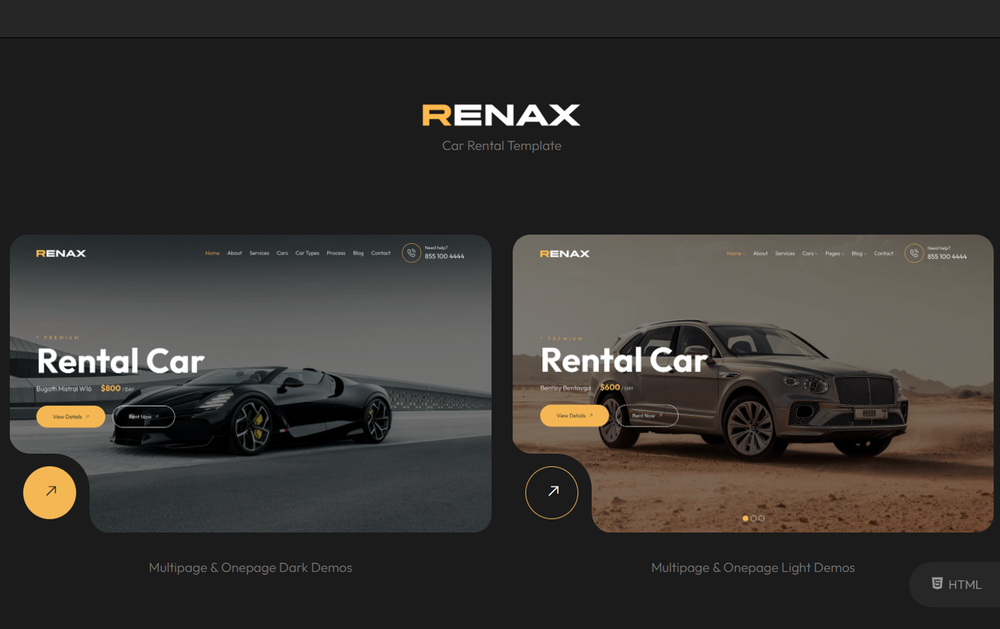

# Personal Portfolio

A modern and responsive personal portfolio website to showcase projects, skills, and contact information.

## Features

- Clean and modern design
- Fully responsive layout
- Sections for About Me, Projects, Skills, and Contact
- Interactive elements with JavaScript
- Uses HTML, CSS, and JavaScript

## Screenshots


## Projects Included

- Car Rental App 
- Cosmetic Store 
- Weather App 
- User Authentication App 

## How to Use

1. Clone the repository:
   ```bash
   git clone https://github.com/NimraAsmat/personal-portfolio.git
